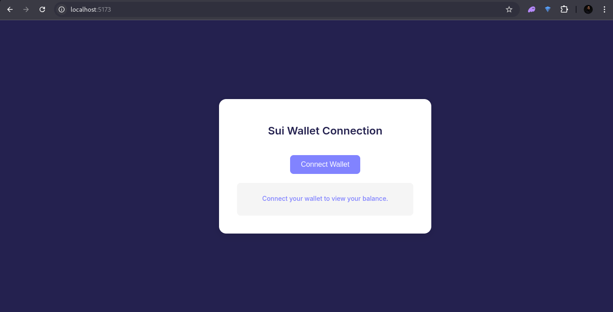

# Sui Wallet Connection

A simple and elegant React application for connecting Sui-compatible wallets and displaying wallet balances. Built with **React**, **Vite**, **TypeScript**, and **@mysten/dapp-kit**.



---

## Features

- **Wallet Connection**: Connect any Sui-compatible wallet (e.g., Sui Wallet, Ethos Wallet).
- **Balance Display**: View the wallet balance in SUI after connecting.
- **Disconnect Wallet**: Easily disconnect the connected wallet.
- **Modern UI**: Clean and professional design using Sui's brand colors.

---

## Technologies Used

- **React**: A JavaScript library for building user interfaces.
- **Vite**: A fast build tool for modern web development.
- **TypeScript**: A typed superset of JavaScript for better developer experience.
- **@mysten/dapp-kit**: A library for integrating Sui wallets into dApps.
- **@mysten/sui**: The Sui TypeScript SDK for interacting with the Sui blockchain.

---

## Getting Started

Follow these steps to set up and run the project locally.

### Prerequisites

- **Node.js**: Ensure you have Node.js installed (v16 or higher).
- **npm**: Node Package Manager (comes with Node.js).

### Installation

1. Clone the repository:
   ```bash
   git clone https://github.com/your-username/sui-wallet-connection.git
Navigate to the project directory:

  ```bash
  Copy
  cd sui-wallet-connection
  Install dependencies:

  npm install
  Running the Project
  Start the development server:

  npm run dev
  Open your browser and navigate to:

  Copy
  http://localhost:5173
Usage
Connect a Wallet:

Click the Connect Wallet button.

Select a Sui-compatible wallet from the popup (e.g., Sui Wallet, Ethos Wallet).

Approve the connection in your wallet.

View Wallet Balance:

After connecting, the wallet balance will be displayed in SUI.

Disconnect Wallet:

Click the Connect Wallet button again to disconnect.

Folder Structure
Copy
sui-wallet-connection/
├── public/                  # Static assets (e.g., images, favicon)
├── src/
│   ├── components/          # Reusable React components
│   │   └── WalletBalance.tsx
│   ├── App.tsx              # Main application component
│   ├── main.tsx             # Entry point for the app
│   ├── styles/              # CSS or styling files
│   │   └── App.css
├── .gitignore               # Files to ignore in Git
├── index.html               # HTML template
├── package.json             # Project dependencies and scripts
├── tsconfig.json            # TypeScript configuration
├── vite.config.ts           # Vite configuration
└── README.md                # Project documentation
Customization
Styling
The app uses Sui's brand colors and modern typography. You can customize the styles in src/styles/App.css.

Wallet Configuration
To change the default network or add custom networks, update the SuiClientProvider configuration in src/App.tsx:

tsx
Copy
<SuiClientProvider networks={{ mainnet: { url: getFullnodeUrl('mainnet') } }} defaultNetwork="mainnet">
Contributing
Contributions are welcome! If you'd like to contribute, please follow these steps:

Fork the repository.

Create a new branch:

bash
Copy
git checkout -b feature/your-feature-name
Commit your changes:

bash
Copy
git commit -m "Add your feature"
Push to the branch:

bash
Copy
git push origin feature/your-feature-name
Open a pull request. 
```

License
This project is licensed under the MIT License. See the LICENSE file for details.

Acknowledgments
Sui Team: For building the Sui blockchain and providing the @mysten/dapp-kit library.

Vite: For the fast and modern build tool.

React Community: For the amazing ecosystem of tools and libraries.

Contact
For questions or feedback, feel free to reach out:

Idopise: edwinidopise@gmail.com

GitHub: Icekidtech
